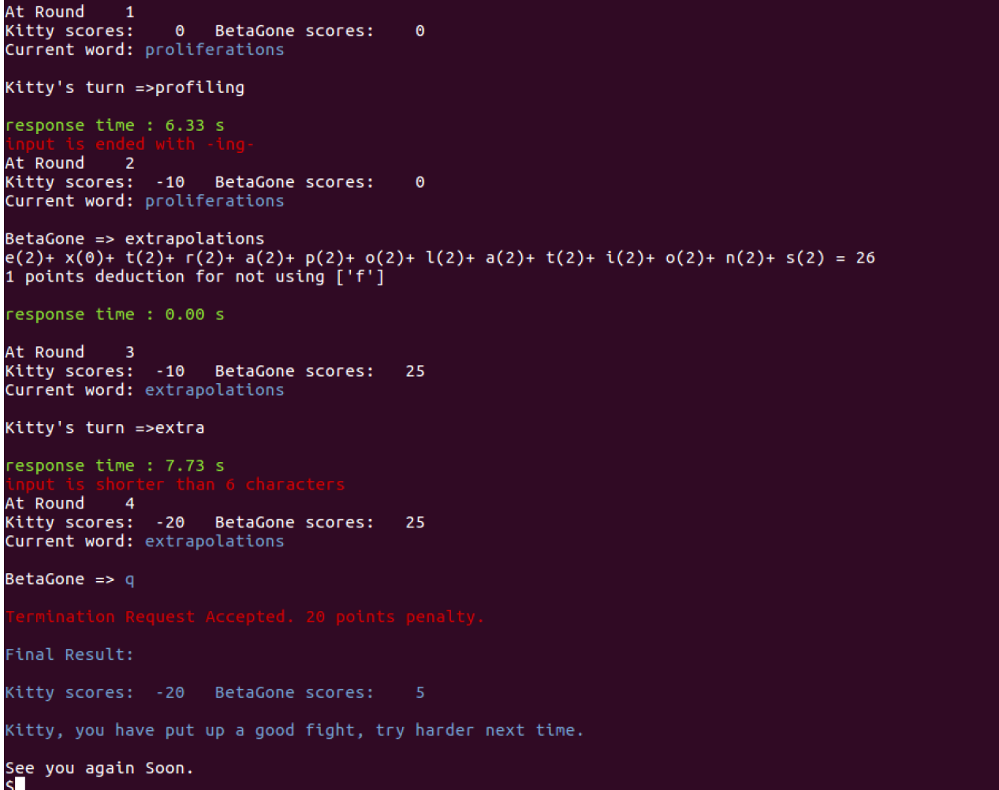

# Playground Word Game (AI Bot)

## Introduction

This is a Python program that simulates a two player word game. The program will first prompt the human player to enter his/her name to start
a new game session. A game session begins by showing an initial challenging word (randomly picked by the program). The player and AI bot over
the network will take turns to enter a new word in response to the challenge based on the game rules and earn points. 

## Preview

## Usage

1. Clone this repository into any directory.

2. Enter the "playground-word-game-ai" directory by typing `cd playground-word-game-ai`. 

3. Start the network server by typing `python3 soloServer.py`. 

4. Run the client program by typing `python3 soloClient.py`.

## Disclaimer

This program was developed as an assignment for the Singapore Polytechnic, ST2411 Programming in Python and C module. I have uploaded the source files publicly for reference and personal usage only. Please refrain from [plagiarising](https://www.sp.edu.sg/sp/student-services/ssc-overview/student-handbook/intellectual-property-copyright-and-plagiarism) or passing it off as your own work. 

**Developer**

- Chua Han Yong Darren ([@chydarren](https://github.com/chydarren))

## Copyright and License 

Chua Han Yong Darren © 2017. Code released under the GNU Affero General Public License v3.0.
